# SIP Yield Dashboard

> **Note:** All data, device names, handler names, stations, soft bins, errCodes, and identifiers shown in this repository have been fully anonymized for public portfolio usage. No proprietary manufacturing or customer-sensitive data is included.

Production-style semiconductor manufacturing analytics dashboard built using **Python**, **DuckDB**, **SQL**, **Streamlit**, and **Plotly**.

---

# Overview

This project is an end-to-end semiconductor manufacturing analytics solution that automates the transformation of raw production test logs into engineering dashboards and manufacturing KPI reports.

The solution demonstrates a complete local analytics pipeline built using modern data engineering principles, including:

* Automated raw file ingestion
* ETL transformation
* Data validation and standardization
* SQL-based analytical modeling
* KPI aggregation
* Interactive dashboard visualization
* Automated HTML report generation

The analytics workflows were designed around semiconductor final-test manufacturing operations, supporting engineering investigations such as yield monitoring, defect analysis, retest recovery, and equipment performance evaluation.

---

# 🚀 Interactive Dashboard Demo

This project generates standalone interactive HTML dashboards that enable engineers and stakeholders to explore semiconductor manufacturing KPIs without requiring Python, a database connection, or BI software.

The sample dashboards below are generated using anonymized data and demonstrate both operational and executive-level reporting.

## 📊 Device Dashboard

Daily manufacturing dashboard for a single semiconductor device featuring:

- Yield and Retest Pass Rate (RPR) trends
- Interactive defect Pareto analysis
- Expandable data tables

**🌐 Launch Interactive Dashboard Demo:**  
[SiP_Yield_Dashboard_DV029_device.html](https://kenbugasto.github.io/semiconductor-yield-dashboard/demo/SIP_Yield_Dashboard_DV029_device.html)

---

## 📈 Executive Performance Dashboard

Management dashboard consolidating multiple semiconductor devices into a single executive view featuring:

- Year-over-Year (YoY) analysis
- Quarter-over-Quarter (QoQ) analysis
- Month-over-Month (MoM) analysis
- Cross-device KPI trend visualization

**🌐 Launch Interactive Dashboard Demo:**  
- [SiP_YoY_Dashboard_Demo.html](https://kenbugasto.github.io/semiconductor-yield-dashboard/demo/SIP_YoY_Dashboard_Demo.html)
- [SiP_QoQ_Dashboard_Demo.html](https://kenbugasto.github.io/semiconductor-yield-dashboard/demo/SIP_QoQ_Dashboard_Demo.html)
- [SiP_MoM_Dashboard_Demo.html](https://kenbugasto.github.io/semiconductor-yield-dashboard/demo/SIP_MoM_Dashboard_Demo.html)

> Note: These standalone HTML reports can be viewed directly in a web browser and retain Plotly's interactive hover tooltips, zooming, and panning capabilities.

---

# Data Sources

The dashboard processes manufacturing production data originating from:

* Raw `.txt` production logs
* `.log` equipment output files

The ETL pipeline transforms these semi-structured manufacturing files into analytics-ready DuckDB tables for downstream reporting and dashboard visualization.

---

# Core Features

## ETL / Data Engineering

* Automated raw text file ingestion
* Incremental ETL pipeline
* SQL-based analytical transformations
* DuckDB analytical warehouse
* Window-function based deduplication
* Config-driven deployment architecture
* Automated HTML report generation
* Shared export automation

## Manufacturing Analytics

* 4-week yield monitoring
* First Pass Yield (FPY)
* Final Test Yield (FTY)
* Lot Rejection Rate (LRR)
* Retest Pass Rate (RPR)
* Top defect Pareto analysis
* Handler performance analysis
* Lot-level yield monitoring
* Mother-lot yield monitoring

## Long-Term Manufacturing Trend Analytics

Includes:

* Year-over-Year (YoY) trend analysis
* Quarter-over-Quarter (QoQ) trend analysis
* Month-over-Month (MoM) trend analysis
* Long-horizon defect monitoring
* Manufacturing performance comparison across time periods

---

# Technology Stack

| Category        | Technology             |
| --------------- | ---------------------- |
| Language        | Python                 |
| Query Language  | SQL                    |
| Database        | DuckDB                 |
| Data Processing | Pandas                 |
| Dashboard       | Streamlit              |
| Visualization   | Plotly                 |
| ETL             | Python + SQL           |
| Scheduling      | Windows Task Scheduler |
| Reporting       | HTML Export            |

---

# Architecture & Technology Decisions

## Why DuckDB

DuckDB was selected as the analytical database because it provides:

* Lightweight deployment
* Fast analytical query performance
* Embedded SQL execution
* Minimal infrastructure requirements
* Easy portability within restricted enterprise environments

The project environment did not permit deploying heavier database platforms such as SQL Server or PostgreSQL. DuckDB provided an excellent balance between analytical performance and operational simplicity for manufacturing KPI workloads.

---

## Why Streamlit

Streamlit enabled rapid development of interactive engineering dashboards without requiring enterprise BI licensing or additional infrastructure.

Benefits include:

* Python-native development
* Rapid dashboard creation
* Interactive engineering visualization
* Standalone HTML report generation
* Low maintenance overhead

This allowed the dashboard to function as a lightweight internal manufacturing analytics platform under constrained tooling environments.

---

# Medallion Architecture

Although implemented locally using Python and DuckDB rather than Databricks Delta Lake, this project follows the same Medallion Architecture principles by separating raw ingestion, standardized transformations, and business-ready analytics.

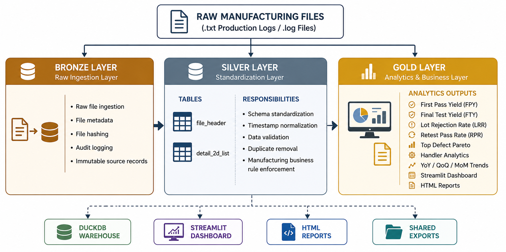

## Bronze Layer

The Bronze layer is responsible for ingesting raw manufacturing production files while preserving their original structure and metadata.

Responsibilities include:

* Raw file ingestion
* File hash generation
* Audit logging
* Source metadata preservation
* Incremental load tracking

## Silver Layer

The Silver layer transforms semi-structured manufacturing logs into standardized analytical tables.

Primary tables:

* `file_header`
* `detail_2d_list`

Responsibilities include:

* Schema standardization
* Timestamp normalization
* Data validation
* Duplicate removal
* Manufacturing business rule enforcement

## Gold Layer

The Gold layer prepares business-ready manufacturing analytics used by engineering dashboards and automated reports.

Examples include:

* First Pass Yield (FPY)
* Final Test Yield (FTY)
* Lot Rejection Rate (LRR)
* Retest Pass Rate (RPR)
* Top Defect Pareto
* Handler Analytics
* Year-over-Year (YoY), Quarter-over-Quarter (QoQ), and Month-over-Month (MoM) trend analysis

---

# Data Model

The ETL pipeline separates lot-level manufacturing metadata from unit-level production records. This normalized design minimizes duplicated information while supporting efficient KPI reporting, engineering investigations, and complete traceability back to the original production file.

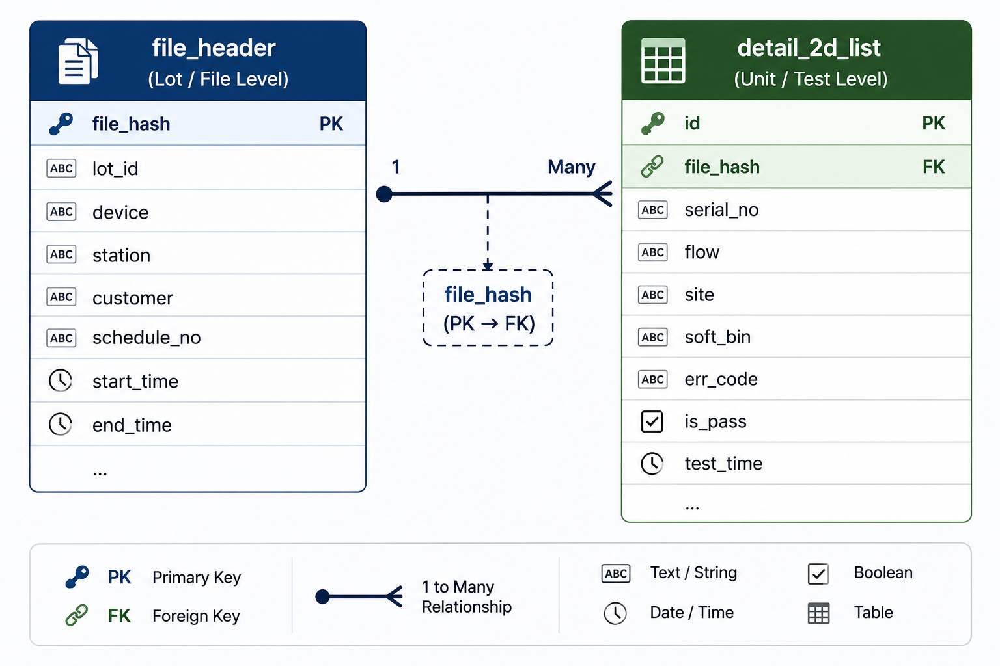

## Modeling Decisions

The data model intentionally separates lot-level metadata from unit-level manufacturing test records.

This normalization provides several advantages:

* Reduces duplicated information
* Supports efficient lot-level KPI aggregation
* Enables detailed unit-level defect investigation
* Maintains complete traceability through `file_hash`
* Simplifies future expansion for additional manufacturing analytics

---
## Production SQL Design

Manufacturing production files may be uploaded more than once due to regenerated reports, repeated transfers, or equipment-side retries. To prevent duplicate uploads from inflating production quantity, yield, and defect metrics, the pipeline applies cohort-based deduplication using SQL CTEs and window functions.

### Cohort Logic

The key design decision is the `PARTITION BY` logic. Instead of treating every uploaded file as unique, the query groups records into manufacturing cohorts using:

* `device_code`
* `station`
* `schedule_no`
* production date from `end_time`

Each cohort represents one logical production lot for one device, station, schedule, and production day.

```sql
WITH scoped_header AS (
    SELECT *
    FROM file_header
    WHERE device_code = '<selected_device>'
),
max_day AS (
    SELECT CAST(MAX(end_time) AS DATE) AS latest_day
    FROM scoped_header
),
latest_header_per_lot AS (
    SELECT *
    FROM (
        SELECT
            *,
            ROW_NUMBER() OVER (
                PARTITION BY
                    device_code,
                    station,
                    schedule_no,
                    CAST(end_time AS DATE)
                ORDER BY
                    end_time DESC NULLS LAST,
                    source_modified_time DESC NULLS LAST,
                    file_hash DESC
            ) AS rn
        FROM scoped_header
        WHERE CAST(end_time AS DATE) BETWEEN
            (SELECT latest_day - INTERVAL 27 DAY FROM max_day)
            AND
            (SELECT latest_day FROM max_day)
    ) x
    WHERE rn = 1
)
SELECT *
FROM latest_header_per_lot;
```

### Why This Matters

This logic ensures that each manufacturing cohort contributes only one authoritative record to downstream KPI calculations.

The `ROW_NUMBER()` window function ranks duplicate candidates within each cohort. The `ORDER BY` clause keeps the latest completed record based on:

1. latest `end_time`
2. latest `source_modified_time`
3. latest `file_hash` as a deterministic tie-breaker

This protects the dashboard from double-counting production quantity, yield, retest, and defect metrics.

### Engineering Highlights

* CTEs separate filtering, date scoping, and deduplication into readable stages.
* `PARTITION BY` defines the manufacturing cohort grain.
* `ROW_NUMBER()` selects one trusted record per cohort.
* `ORDER BY` provides deterministic ranking for repeatable results.
* The 28-day rolling window limits processing to the reporting period used by the dashboard.

---

# Production ETL Design

The loader follows a defensive ETL pattern designed for daily manufacturing reporting. Instead of assuming every source file is valid, each file is checked, scoped, hashed, loaded, audited, and safely skipped when needed.

```python
for i, txt_path in enumerate(txt_files, start=1):
    try:
        write_run_log(RUN_LOG_PATH, f"[{i}/{len(txt_files)}] Checking {txt_path.name}")

        # Parse header metadata first before loading any data.
        row = parse_header_block(txt_path)

        station_val = clean_text(row.get("station"))
        device_code_val = (clean_text(row.get("device_code")) or "").upper()
        customer_val = (clean_text(row.get("customer")) or "").upper()

        # Defensive scope check:
        # Skip files outside the supported customer / product scope.
        if not is_valid_customer(customer_val):
            skipped_count += 1
            skipped_non_XU_count += 1
            write_run_log(
                RUN_LOG_PATH,
                f"Skipped non-scoped customer file: {txt_path.name} | customer={row.get('customer')}"
            )
            continue

        # Defensive station validation:
        # Prevent unsupported stations from entering the analytical database.
        if not is_valid_station(station_val):
            skipped_count += 1
            skipped_invalid_station_count += 1
            write_run_log(
                RUN_LOG_PATH,
                f"Skipped invalid station: {txt_path.name} | station={station_val}"
            )
            continue

        # Freshness check:
        # Skip files outside the current reporting window.
        file_dt = row.get("start_time") or row.get("end_time") or row.get("source_modified_time")
        if file_dt is not None and file_dt < cutoff_dt:
            skipped_count += 1
            write_run_log(
                RUN_LOG_PATH,
                f"Skipped old file outside 1-month cutoff: {txt_path.name}"
            )
            continue

        # Incremental loading:
        # File hash prevents unchanged files from being loaded repeatedly.
        fresh = is_fresh_file(
            conn=conn,
            file_hash=row["file_hash"]
        )

        if not fresh:
            skipped_count += 1
            skipped_unchanged_count += 1
            write_run_log(RUN_LOG_PATH, f"Skipped unchanged file: {txt_path.name}")
            continue

        # Safe reload pattern:
        # Header/detail rows are deleted and reinserted by file_hash.
        upsert_header_row(conn, row)

        detail_df = parse_2d_list_block(txt_path, row)
        replace_detail_rows_for_file(conn, detail_df, row["file_hash"])

        update_audit_success(conn, row)

        touched_file_hashes.append(row["file_hash"])
        loaded_count += 1

        write_run_log(
            RUN_LOG_PATH,
            f"Loaded {txt_path.name} | station={row['station']} | "
            f"device={row['device_code']} | lot_id={row['lot_id']} | "
            f"detail_rows={len(detail_df):,}"
        )

    except Exception as e:
        # Failure isolation:
        # One malformed file is logged and audited without hiding the root cause.
        write_run_log(RUN_LOG_PATH, f"FAILED {txt_path.name} | Error: {e}")
        if conn is not None:
            update_audit_failed(conn, txt_path, str(e))
```

## Defensive ETL Highlights

This section demonstrates several production-oriented ETL practices:

* **Config-driven paths** keep local, shared, and export directories outside the source code.
* **Customer and station validation** prevents non-scoped manufacturing data from entering the dashboard.
* **File hash checking** enables incremental loading and avoids duplicate processing.
* **Delete-and-reload by `file_hash`** makes reruns deterministic and safe.
* **Audit logging** records successful and failed file loads.
* **Exception handling** isolates malformed files without stopping the entire pipeline.
* **Run counters** track loaded, skipped, invalid, unchanged, and duplicate records.
* **Post-load deduplication** removes duplicate lot uploads before KPI calculation.
* **Security checks before export** prevent non-scoped customer, station, or device records from being shared.

This design makes the loader repeatable, traceable, and suitable for automated daily manufacturing reporting.

---

# Dashboard Screenshots

The following screenshots demonstrate the analytical outputs generated from the ETL pipeline and SQL transformation layers described above.

The dashboards support manufacturing engineers with daily operational monitoring, yield analysis, defect investigation, retest recovery tracking, and long-term production trend analysis.

---

# KPI Cards


Production KPI summary cards for:

* First Pass Yield (FPY)
* Final Test Yield (FTY)
* Retest Pass Rate (RPR)
* Lot Rejection Rate (LRR)
* Input and output quantity monitoring

---

# 4-Week Yield Trend

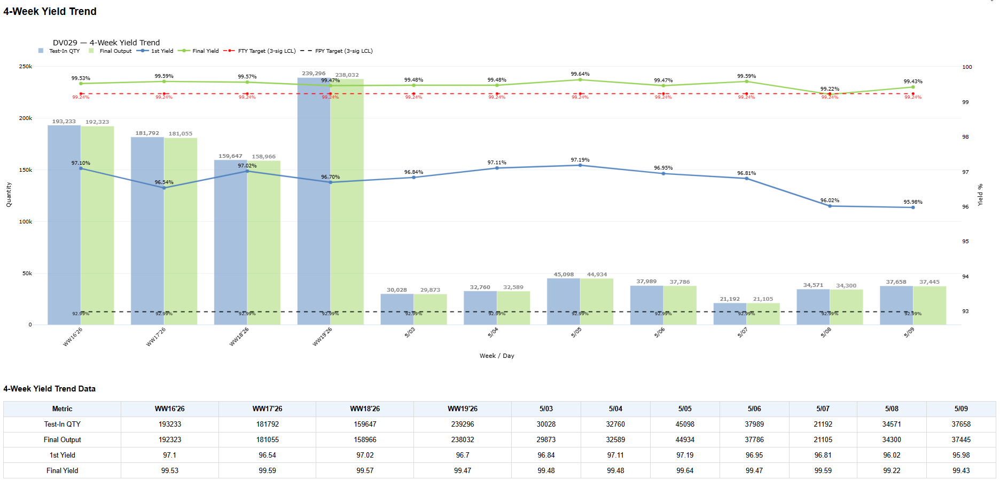

Rolling four-week manufacturing trend visualization showing:

* Test-in quantity
* Output quantity
* First Pass Yield
* Final Test Yield
* Dynamic target monitoring

---

# Top 5 Defect Distribution

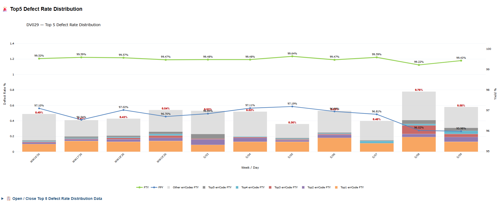

Defect Pareto visualization supporting:

* Top defect contributors
* Stacked defect rate monitoring
* FPY and FTY trend comparison

---

# Mother Lot Yield Trend

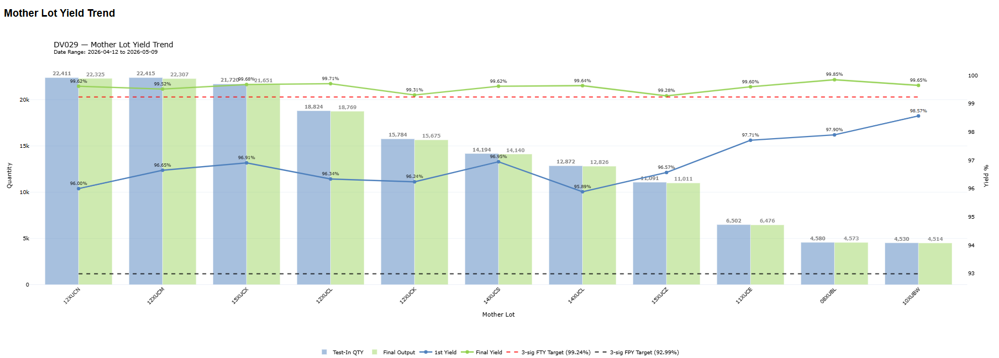

Mother-lot analytics supporting:

* Upstream process excursion tracking
* Yield trend monitoring
* Manufacturing root-cause investigation
* High-level production comparison

Scope:

* Rolling four-week production
* Recent seven-day operational monitoring

---

# Per Lot Yield Trend

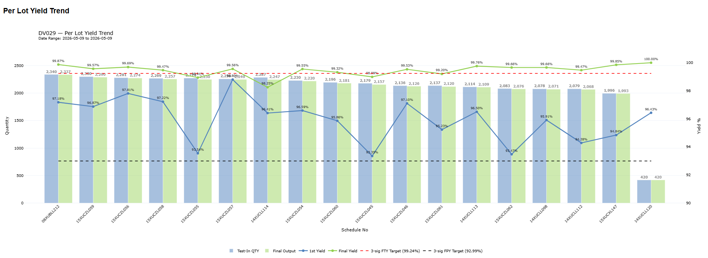

Lot-level engineering analytics supporting:

* Related lot comparison
* Abnormal yield detection
* Retest investigation
* Engineering containment workflows
* Detailed lot-by-lot performance analysis

Scope:

* Previous-day operational production monitoring

---
# LRR Trend Monitoring

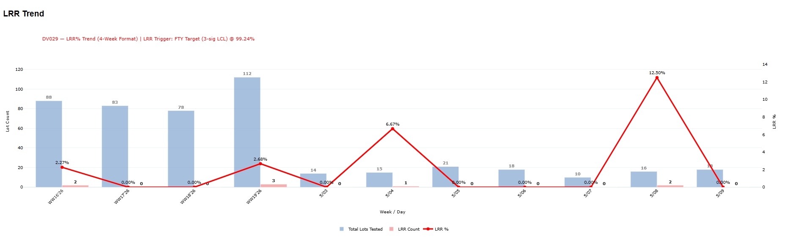

Lot Rejection Rate (LRR) monitoring dashboard including:

* LRR percentage
* Rejected lot counts
* Historical trend monitoring
* Automatic threshold tracking

---

# LRR Summary Table

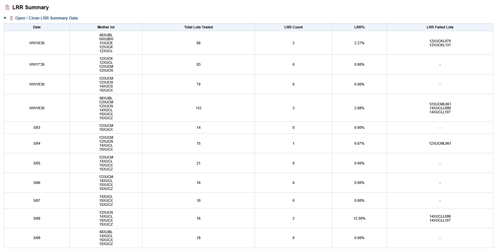

Detailed LRR summary analytics including:

* Rejected lots
* Mother-lot visibility
* Rolling four-week aggregation

---

# Retest Pass Rate errCode Distribution

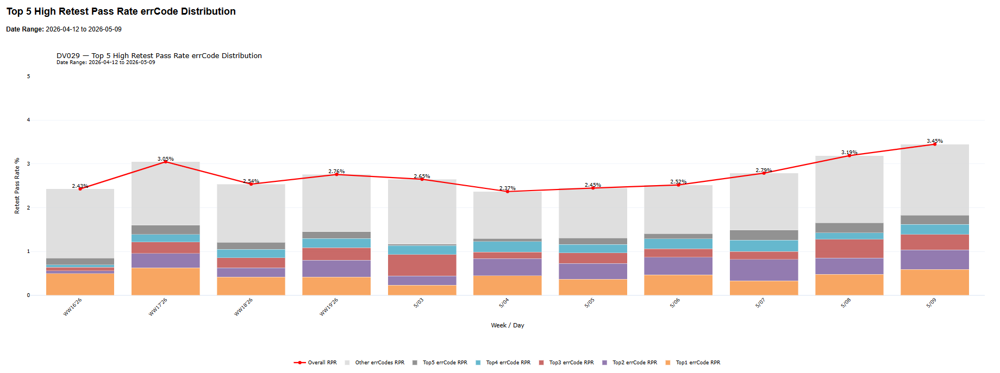

Retest recovery analytics showing:

* Highest recovery errCodes
* Recovery contribution distribution
* Defect recovery monitoring

---

# Handler vs RPR Analysis

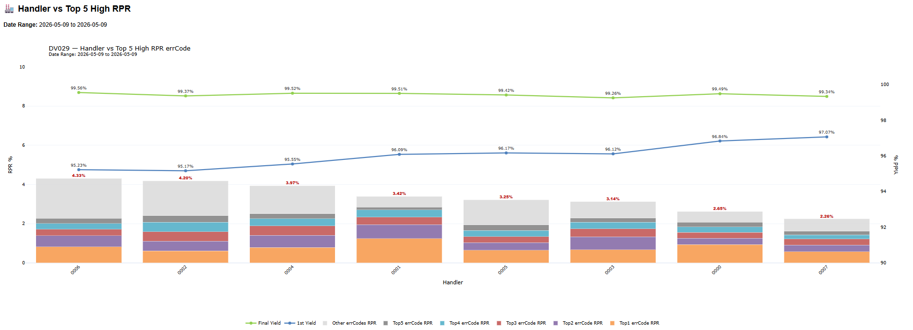

Equipment-level engineering analytics supporting:

* Handler contribution analysis
* Retest recovery comparison
* Top errCode contributors by handler

---

# Year-over-Year Yield Trend

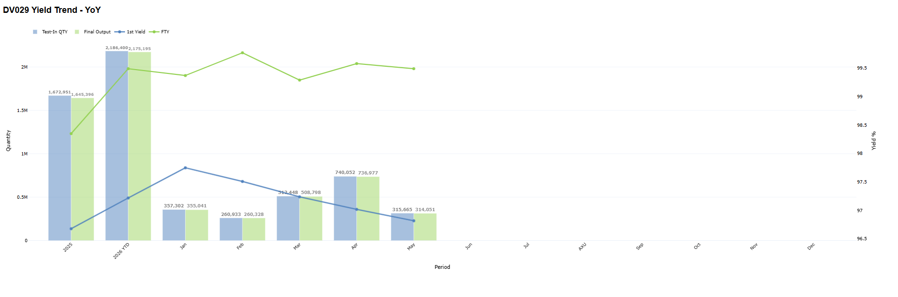

Year-over-Year manufacturing yield comparison.

---

# Year-over-Year Top 5 Defect Rate

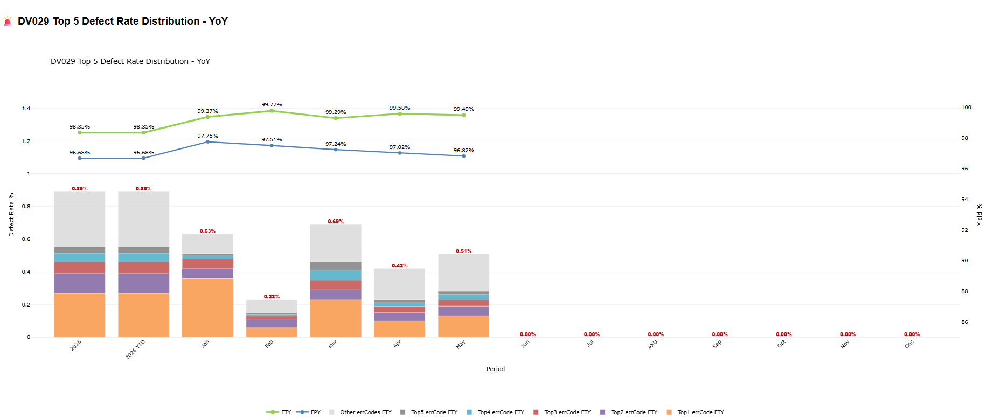

Year-over-Year defect Pareto monitoring.

---

# Quarter-over-Quarter Yield Trend

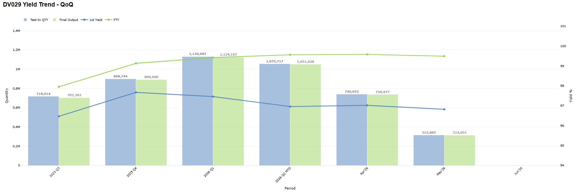

Quarter-over-Quarter manufacturing yield comparison.

---

# Quarter-over-Quarter Top 5 Defect Rate

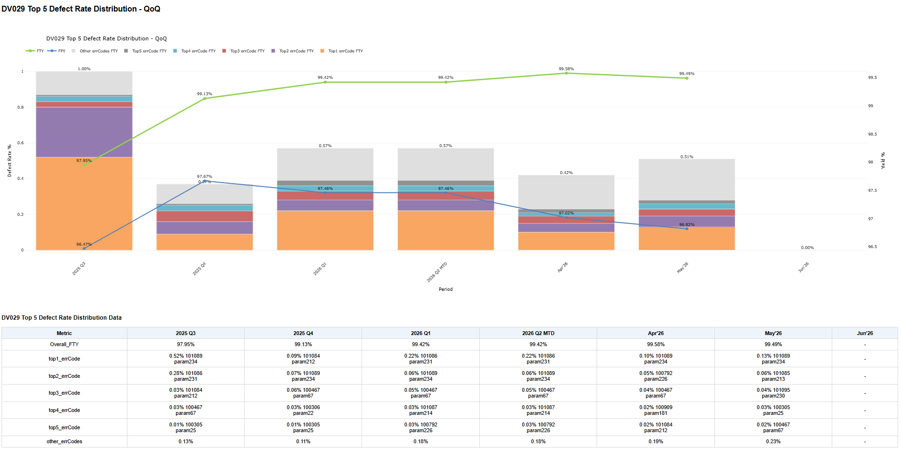

Quarter-over-Quarter defect Pareto monitoring.

---

# Month-over-Month Yield Trend

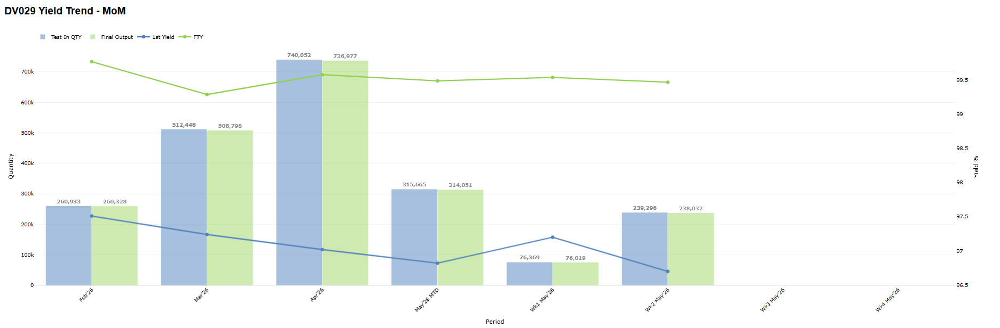

Month-over-Month manufacturing yield comparison.

---

# Month-over-Month Top 5 Defect Rate

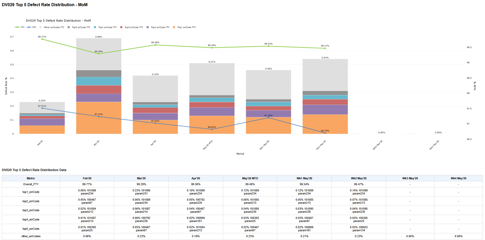

Month-over-Month defect Pareto monitoring.

---

# Project Roadmap

## Current Features

* Automated TXT / LOG ingestion pipeline
* Semiconductor yield analytics dashboard
* Manufacturing KPI reporting
* Retest and defect monitoring
* Automated HTML report generation
* Mother-lot and lot-level analytics
* YoY / QoQ / MoM manufacturing trend analysis

---

## In Progress

### Phase 2 Manufacturing Analytics Expansion

The next phase extends the platform from yield analytics into overall manufacturing equipment performance monitoring.

Planned capabilities include:

* CSV production data ingestion
* Overall Equipment Effectiveness (OEE)
* Equipment downtime classification
* Equipment utilization monitoring
* Cycle time analytics
* Manufacturing stop categorization
* Hourly production reporting
* Operational performance dashboards

---

# Repository Structure

```text
SIP_Dashboard_GitHub/
│
├── docs/                 # Project documentation
├── screenshots/          # Dashboard screenshots
├── src/
│   ├── config/           # Configuration files
│   ├── etl/              # ETL pipeline
│   ├── sql/              # SQL transformations
│   ├── dashboard/        # Streamlit application
│   └── utils/            # Shared helper functions
│
├── reports/              # HTML report outputs
├── README.md
└── requirements.txt
```

---

# Key Engineering Concepts Demonstrated

This project demonstrates practical implementation of several data engineering concepts commonly used in modern analytics platforms:

### Data Engineering

* Incremental ETL pipelines
* Defensive ETL design
* Configuration-driven architecture
* Data validation
* Audit logging
* Incremental loading
* Data normalization

### SQL Engineering

* Common Table Expressions (CTEs)
* Window Functions
* Analytical aggregations
* Manufacturing KPI calculations
* Data deduplication
* Multi-stage transformations

### Analytics Engineering

* Medallion Architecture
* Layered data modeling
* Business-ready analytical datasets
* Manufacturing KPI reporting
* Time-series trend analysis

### Software Engineering

* Modular Python architecture
* Configuration management
* Automated reporting
* Reusable helper functions
* Separation of concerns

---

## Author

This repository was developed as a portfolio project demonstrating production-oriented data engineering techniques applied to semiconductor manufacturing analytics.

The implementation emphasizes practical ETL design, SQL engineering, manufacturing KPI modeling, and lightweight analytics architecture using Python, DuckDB, and Streamlit.
