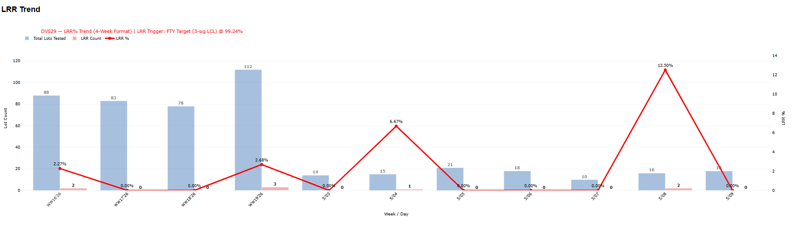
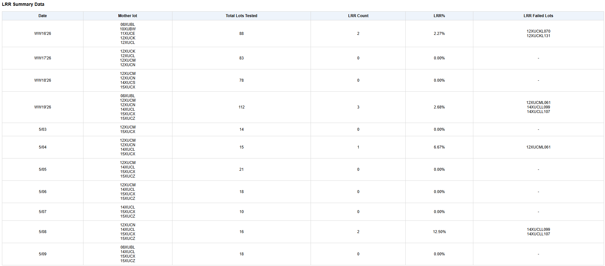
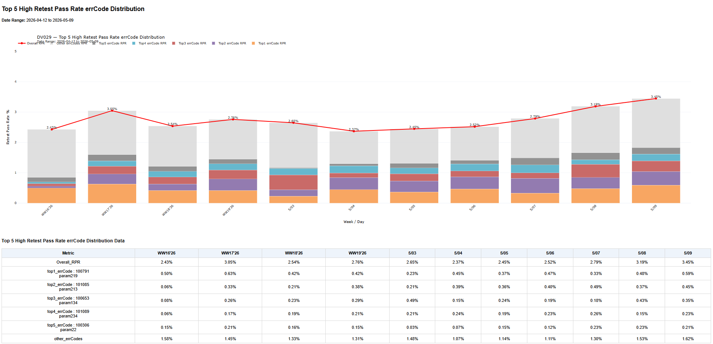
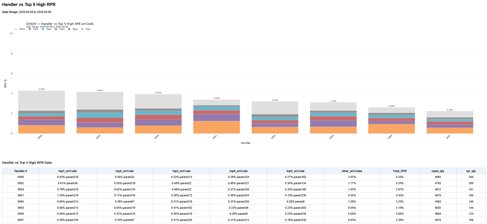

# SIP Yield Dashboard

> **Note:** All data, device names, handler names, stations, soft bins, errCodes, and identifiers shown in this repository have been fully anonymized for public portfolio usage. No proprietary manufacturing or customer-sensitive data is included.

Production-style semiconductor manufacturing analytics dashboard built using **Python**, **DuckDB**, **SQL**, **Streamlit**, and **Plotly**.

---

# Overview

This project is an end-to-end semiconductor manufacturing analytics solution that automates the transformation of raw production test logs into engineering dashboards and manufacturing KPI reports.

The solution demonstrates a complete local analytics pipeline built using modern data engineering principles, including:

* Automated raw file ingestion
* ETL transformation
* Data validation and standardization
* SQL-based analytical modeling
* KPI aggregation
* Interactive dashboard visualization
* Automated HTML report generation

The analytics workflows were designed around semiconductor final-test manufacturing operations, supporting engineering investigations such as yield monitoring, defect analysis, retest recovery, and equipment performance evaluation.

---

# Data Sources

The dashboard processes manufacturing production data originating from:

* Raw `.txt` production logs
* `.log` equipment output files

The ETL pipeline transforms these semi-structured manufacturing files into analytics-ready DuckDB tables for downstream reporting and dashboard visualization.

---

# Core Features

## ETL / Data Engineering

* Automated raw text file ingestion
* Incremental ETL pipeline
* SQL-based analytical transformations
* DuckDB analytical warehouse
* Window-function based deduplication
* Config-driven deployment architecture
* Automated HTML report generation
* Shared export automation

## Manufacturing Analytics

* 4-week yield monitoring
* First Pass Yield (FPY)
* Final Test Yield (FTY)
* Lot Rejection Rate (LRR)
* Retest Pass Rate (RPR)
* Top defect Pareto analysis
* Handler performance analysis
* Lot-level yield monitoring
* Mother-lot yield monitoring

## Long-Term Manufacturing Trend Analytics

Includes:

* Year-over-Year (YoY) trend analysis
* Quarter-over-Quarter (QoQ) trend analysis
* Month-over-Month (MoM) trend analysis
* Long-horizon defect monitoring
* Manufacturing performance comparison across time periods

---

# Technology Stack

| Category        | Technology             |
| --------------- | ---------------------- |
| Language        | Python                 |
| Query Language  | SQL                    |
| Database        | DuckDB                 |
| Data Processing | Pandas                 |
| Dashboard       | Streamlit              |
| Visualization   | Plotly                 |
| ETL             | Python + SQL           |
| Scheduling      | Windows Task Scheduler |
| Reporting       | HTML Export            |

---

# Architecture & Technology Decisions

## Why DuckDB

DuckDB was selected as the analytical database because it provides:

* Lightweight deployment
* Fast analytical query performance
* Embedded SQL execution
* Minimal infrastructure requirements
* Easy portability within restricted enterprise environments

The project environment did not permit deploying heavier database platforms such as SQL Server or PostgreSQL. DuckDB provided an excellent balance between analytical performance and operational simplicity for manufacturing KPI workloads.

---

## Why Streamlit

Streamlit enabled rapid development of interactive engineering dashboards without requiring enterprise BI licensing or additional infrastructure.

Benefits include:

* Python-native development
* Rapid dashboard creation
* Interactive engineering visualization
* Standalone HTML report generation
* Low maintenance overhead

This allowed the dashboard to function as a lightweight internal manufacturing analytics platform under constrained tooling environments.

---

# Medallion Architecture

Although implemented locally using Python and DuckDB rather than Databricks Delta Lake, this project follows the same Medallion Architecture principles by separating raw ingestion, standardized transformations, and business-ready analytics.


## Bronze Layer

The Bronze layer is responsible for ingesting raw manufacturing production files while preserving their original structure and metadata.

Responsibilities include:

* Raw file ingestion
* File hash generation
* Audit logging
* Source metadata preservation
* Incremental load tracking

## Silver Layer

The Silver layer transforms semi-structured manufacturing logs into standardized analytical tables.

Primary tables:

* `file_header`
* `detail_2d_list`

Responsibilities include:

* Schema standardization
* Timestamp normalization
* Data validation
* Duplicate removal
* Manufacturing business rule enforcement

## Gold Layer

The Gold layer prepares business-ready manufacturing analytics used by engineering dashboards and automated reports.

Examples include:

* First Pass Yield (FPY)
* Final Test Yield (FTY)
* Lot Rejection Rate (LRR)
* Retest Pass Rate (RPR)
* Top Defect Pareto
* Handler Analytics
* Year-over-Year (YoY), Quarter-over-Quarter (QoQ), and Month-over-Month (MoM) trend analysis

---

# Data Model

The ETL pipeline separates lot-level manufacturing metadata from unit-level production records. This normalized design minimizes duplicated information while supporting efficient KPI reporting, engineering investigations, and complete traceability back to the original production file.

```text
                   file_header
                (Lot / File Level)

             file_hash (PK)
             lot_id
             device
             station
             customer
             schedule_no
             start_time
             end_time
             ...

                    │
                    │ file_hash
                    │
              1 ----┼---- Many
                    │
                    ▼

               detail_2d_list
            (Unit / Test Level)

             id (PK)
             file_hash (FK)
             serial_no
             flow
             site
             soft_bin
             err_code
             is_pass
             test_time
             ...
```

## Modeling Decisions

The data model intentionally separates lot-level metadata from unit-level manufacturing test records.

This normalization provides several advantages:

* Reduces duplicated information
* Supports efficient lot-level KPI aggregation
* Enables detailed unit-level defect investigation
* Maintains complete traceability through `file_hash`
* Simplifies future expansion for additional manufacturing analytics

---
# Production SQL Design

Manufacturing production systems occasionally generate duplicate production files due to regenerated reports, equipment retries, or repeated file transfers. Without a deterministic deduplication strategy, these duplicate uploads can inflate production quantity, yield, and defect metrics.

To ensure reporting accuracy, the ETL pipeline uses Common Table Expressions (CTEs) together with SQL window functions to identify duplicate manufacturing records and retain only the correct production version.

## Engineering Approach

The deduplication logic uses:

* Common Table Expressions (CTEs) to separate transformation stages
* `ROW_NUMBER()` window functions for deterministic ranking
* `PARTITION BY` to identify duplicate manufacturing lots
* `ORDER BY` to consistently select the preferred production record

```sql
-- Replace this section with the actual ROW_NUMBER() production SQL
-- used by the project.

WITH ranked_lots AS (

    SELECT
        *,
        ROW_NUMBER() OVER (
            PARTITION BY
                lot_id,
                device,
                station,
                schedule_no
            ORDER BY
                end_time ASC,
                source_modified_time ASC
        ) AS rn

    FROM file_header

)

SELECT *
FROM ranked_lots
WHERE rn = 1;
```

## Why This Design

This approach provides several advantages:

* Prevents duplicate lot uploads from affecting KPI calculations
* Produces deterministic and repeatable ETL results
* Simplifies downstream SQL transformations
* Improves maintainability by separating transformation stages into readable CTEs
* Demonstrates production use of SQL window functions beyond simple aggregation

---

# Production ETL Design

Manufacturing production files frequently contain duplicate uploads, malformed records, incomplete metadata, or unsupported equipment configurations.

Rather than assuming every source file is valid, the ETL pipeline follows a defensive programming approach that validates each file before loading it into DuckDB.

## ETL Workflow

The loader performs the following sequence for every production file:

1. Parse manufacturing file
2. Validate customer and station scope
3. Calculate file hash
4. Check incremental load history
5. Skip previously processed files
6. Transform raw production data
7. Load analytical tables
8. Update audit log
9. Continue processing even if one file fails

```python
# Replace this section with the actual ETL function
# from the loader pipeline.

for txt_path in txt_files:

    try:

        row = parse_header_block(txt_path)

        if not is_valid_customer(row):
            continue

        if not is_valid_station(row):
            continue

        if already_loaded(row["file_hash"]):
            continue

        load_header_table(row)

        detail_df = parse_detail_records(txt_path)

        load_detail_table(detail_df)

        update_audit_success(row)

    except Exception as ex:

        update_audit_failed(txt_path, ex)
```

## Defensive Programming Techniques

The ETL pipeline incorporates several production-oriented design patterns:

* Incremental loading using file hashes
* Configuration-driven validation rules
* Customer and station filtering
* Safe rerun capability
* Audit logging for successful and failed loads
* Exception handling that isolates malformed files without stopping the pipeline
* Delete-and-reload strategy for deterministic results

These techniques make the pipeline resilient, repeatable, and suitable for automated manufacturing reporting workflows.

---

# Dashboard Screenshots

The following screenshots demonstrate the analytical outputs generated from the ETL pipeline and SQL transformation layers described above.

The dashboards support manufacturing engineers with daily operational monitoring, yield analysis, defect investigation, retest recovery tracking, and long-term production trend analysis.

---

# KPI Cards


Production KPI summary cards for:

* First Pass Yield (FPY)
* Final Test Yield (FTY)
* Retest Pass Rate (RPR)
* Lot Rejection Rate (LRR)
* Input and output quantity monitoring

---

# 4-Week Yield Trend


Rolling four-week manufacturing trend visualization showing:

* Test-in quantity
* Output quantity
* First Pass Yield
* Final Test Yield
* Dynamic target monitoring

---

# Top 5 Defect Distribution


Defect Pareto visualization supporting:

* Top defect contributors
* Stacked defect rate monitoring
* FPY and FTY trend comparison

---

# Mother Lot Yield Trend


Mother-lot analytics supporting:

* Upstream process excursion tracking
* Yield trend monitoring
* Manufacturing root-cause investigation
* High-level production comparison

Scope:

* Rolling four-week production
* Recent seven-day operational monitoring

---

# Per Lot Yield Trend


Lot-level engineering analytics supporting:

* Related lot comparison
* Abnormal yield detection
* Retest investigation
* Engineering containment workflows
* Detailed lot-by-lot performance analysis

Scope:

* Previous-day operational production monitoring

---
# LRR Trend Monitoring



Lot Rejection Rate (LRR) monitoring dashboard including:

* LRR percentage
* Rejected lot counts
* Historical trend monitoring
* Automatic threshold tracking

---

# LRR Summary Table



Detailed LRR summary analytics including:

* Rejected lots
* Mother-lot visibility
* Rolling four-week aggregation

---

# Retest Pass Rate errCode Distribution



Retest recovery analytics showing:

* Highest recovery errCodes
* Recovery contribution distribution
* Defect recovery monitoring

---

# Handler vs RPR Analysis



Equipment-level engineering analytics supporting:

* Handler contribution analysis
* Retest recovery comparison
* Top errCode contributors by handler

---

# Year-over-Year Yield Trend


Year-over-Year manufacturing yield comparison.

---

# Year-over-Year Top 5 Defect Rate


Year-over-Year defect Pareto monitoring.

---

# Quarter-over-Quarter Yield Trend


Quarter-over-Quarter manufacturing yield comparison.

---

# Quarter-over-Quarter Top 5 Defect Rate


Quarter-over-Quarter defect Pareto monitoring.

---

# Month-over-Month Yield Trend


Month-over-Month manufacturing yield comparison.

---

# Month-over-Month Top 5 Defect Rate


Month-over-Month defect Pareto monitoring.

---

# Project Roadmap

## Current Features

* Automated TXT / LOG ingestion pipeline
* Semiconductor yield analytics dashboard
* Manufacturing KPI reporting
* Retest and defect monitoring
* Automated HTML report generation
* Mother-lot and lot-level analytics
* YoY / QoQ / MoM manufacturing trend analysis

---

## In Progress

### Phase 2 Manufacturing Analytics Expansion

The next phase extends the platform from yield analytics into overall manufacturing equipment performance monitoring.

Planned capabilities include:

* CSV production data ingestion
* Overall Equipment Effectiveness (OEE)
* Equipment downtime classification
* Equipment utilization monitoring
* Cycle time analytics
* Manufacturing stop categorization
* Hourly production reporting
* Operational performance dashboards

---

# Repository Structure

```text
SIP_Dashboard_GitHub/
│
├── docs/                 # Project documentation
├── screenshots/          # Dashboard screenshots
├── src/
│   ├── config/           # Configuration files
│   ├── etl/              # ETL pipeline
│   ├── sql/              # SQL transformations
│   ├── dashboard/        # Streamlit application
│   └── utils/            # Shared helper functions
│
├── reports/              # HTML report outputs
├── README.md
└── requirements.txt
```

---

# Key Engineering Concepts Demonstrated

This project demonstrates practical implementation of several data engineering concepts commonly used in modern analytics platforms:

### Data Engineering

* Incremental ETL pipelines
* Defensive ETL design
* Configuration-driven architecture
* Data validation
* Audit logging
* Incremental loading
* Data normalization

### SQL Engineering

* Common Table Expressions (CTEs)
* Window Functions
* Analytical aggregations
* Manufacturing KPI calculations
* Data deduplication
* Multi-stage transformations

### Analytics Engineering

* Medallion Architecture
* Layered data modeling
* Business-ready analytical datasets
* Manufacturing KPI reporting
* Time-series trend analysis

### Software Engineering

* Modular Python architecture
* Configuration management
* Automated reporting
* Reusable helper functions
* Separation of concerns

---

# Future Improvements

Potential future enhancements include:

* Delta Lake implementation
* Databricks migration
* Lakehouse architecture
* Unity Catalog integration
* Automated orchestration with workflow scheduling
* Cloud deployment
* Real-time streaming ingestion
* CI/CD pipeline integration

---

## Author

This repository was developed as a portfolio project demonstrating production-oriented data engineering techniques applied to semiconductor manufacturing analytics.

The implementation emphasizes practical ETL design, SQL engineering, manufacturing KPI modeling, and lightweight analytics architecture using Python, DuckDB, and Streamlit.
